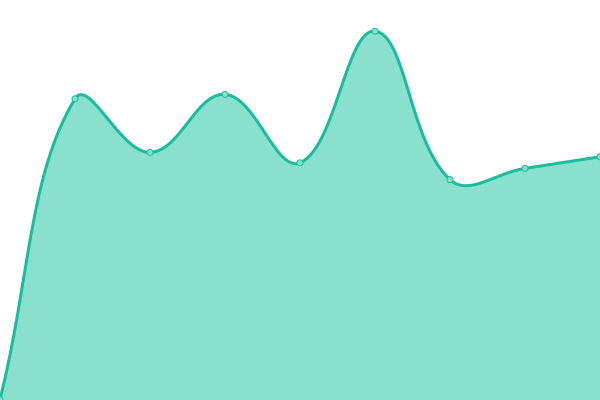

# [📈 Live Status](https://upptime.cervenak.online): <!--live status--> **🟩 All systems operational**

This repository contains the open-source uptime monitor and status page for [jany006](https://upptime.cervenak.online), powered by [Upptime](https://github.com/upptime/upptime).

With [Upptime](https://upptime.js.org), you can get your own unlimited and free uptime monitor and status page, powered entirely by a GitHub repository. We use [Issues](https://github.com/jany006/upptime/issues) as incident reports, [Actions](https://github.com/jany006/upptime/actions) as uptime monitors, and [Pages](https://upptime.cervenak.online) for the status page.

<!--start: status pages-->
<!-- This summary is generated by Upptime (https://github.com/upptime/upptime) -->
<!-- Do not edit this manually, your changes will be overwritten -->
<!-- prettier-ignore -->
| URL | Status | History | Response Time | Uptime |
| --- | ------ | ------- | ------------- | ------ |
|  [LittleLink](https://cervenak.online) | 🟩 Up | [little-link.yml](https://github.com/jany006/upptime/commits/HEAD/history/little-link.yml) | 

 677ms
     
 | 

<a href="https://upptime.cervenak.online/history/little-link">100.00%</a>
    

|  NAS | 🟩 Up | [nas.yml](https://github.com/jany006/upptime/commits/HEAD/history/nas.yml) | 

 756ms
     
 | 

<a href="https://upptime.cervenak.online/history/nas">100.00%</a>
    

|  Git | 🟩 Up | [git.yml](https://github.com/jany006/upptime/commits/HEAD/history/git.yml) | 

 788ms
     
 | 

<a href="https://upptime.cervenak.online/history/git">100.00%</a>
    

|  Ntfy | 🟩 Up | [ntfy.yml](https://github.com/jany006/upptime/commits/HEAD/history/ntfy.yml) | 

 674ms
     
 | 

<a href="https://upptime.cervenak.online/history/ntfy">100.00%</a>
    

|  VAULTWARDEN | 🟩 Up | [vaultwarden.yml](https://github.com/jany006/upptime/commits/HEAD/history/vaultwarden.yml) | 

 702ms
     
 | 

<a href="https://upptime.cervenak.online/history/vaultwarden">100.00%</a>
    

<!--end: status pages-->

[**Visit our status website →**](https://upptime.cervenak.online)

## 📄 License

- Powered by: [Upptime](https://github.com/upptime/upptime)
- Code: [MIT](./LICENSE) © [Anand Chowdhary](https://anandchowdhary.com), supported by [Pabio](https://pabio.com)
- Data in the `./history` directory: [Open Database License](https://opendatacommons.org/licenses/odbl/1-0/)
